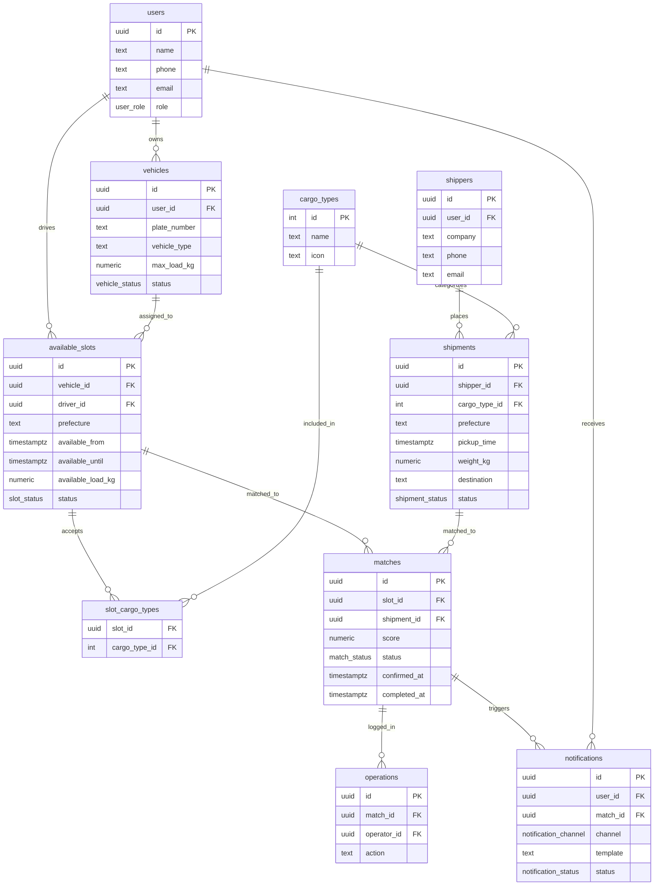
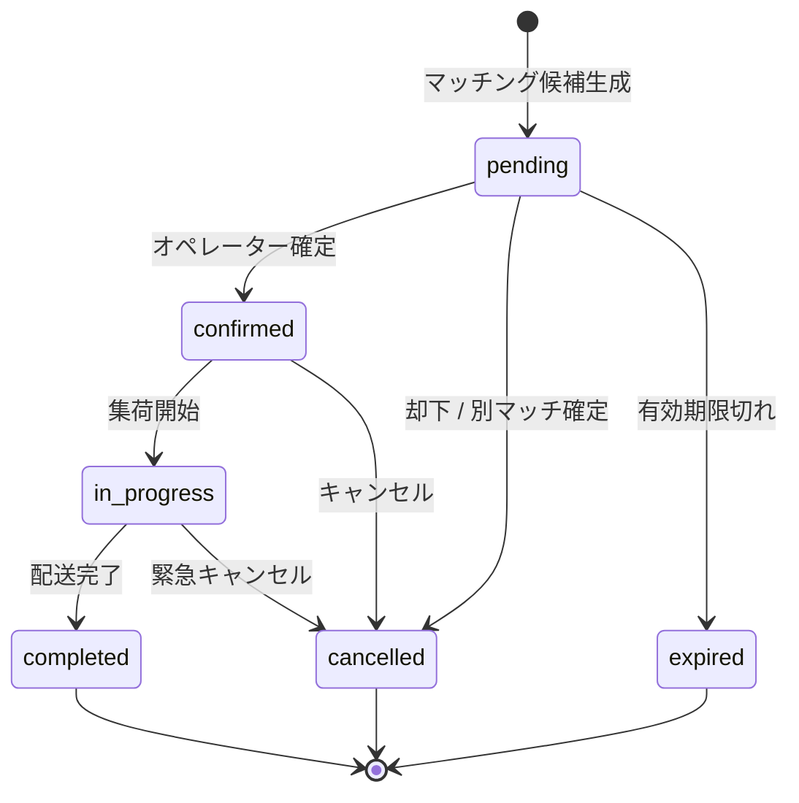

# FreightMatch — 配車マッチングシステム

空車と荷物をリアルタイムにマッチングするプラットフォーム。
Next.js 16 (App Router) + Supabase + Tailwind CSS で構築。

---

## セットアップ

```bash
# 1. 依存インストール
npm install

# 2. 環境変数
cp .env.local.example .env.local
# .env.local を編集して Supabase / Twilio の値を設定

# 3. Supabase スキーマ適用
# Supabase ダッシュボード > SQL Editor で supabase/schema.sql を実行

# 4. 開発サーバー起動
npm run dev
```

開発サーバーは http://localhost:3000 で起動します。

---

## ER図



---

## マッチングステータス遷移図



---

## アーキテクチャ概要

| レイヤー | 技術 | 役割 |
|---|---|---|
| フロントエンド | Next.js 16 App Router | UI、Server Components |
| DB / Auth | Supabase (PostgreSQL) | データ永続化、RLS |
| マッチングロジック | `src/lib/matching.ts` | スコアリング・状態管理 |
| 通知 | Twilio SMS | ドライバー・荷主への通知 |

### スコアリング基準
- **時刻近似（50点）**: 集荷時刻と空車開始時刻の差（±30分以内）
- **積載余裕（30点）**: `(available_load_kg - weight_kg) / weight_kg`
- **荷物種別一致（20点）**: スロットが該当荷物種別を許可している場合
